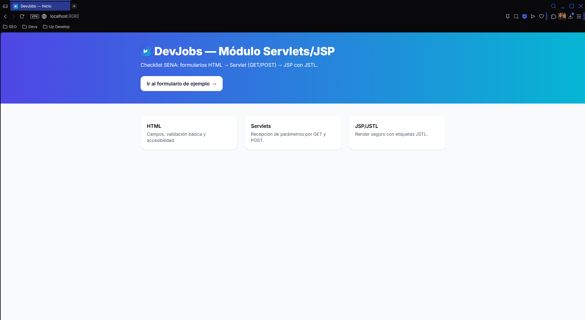
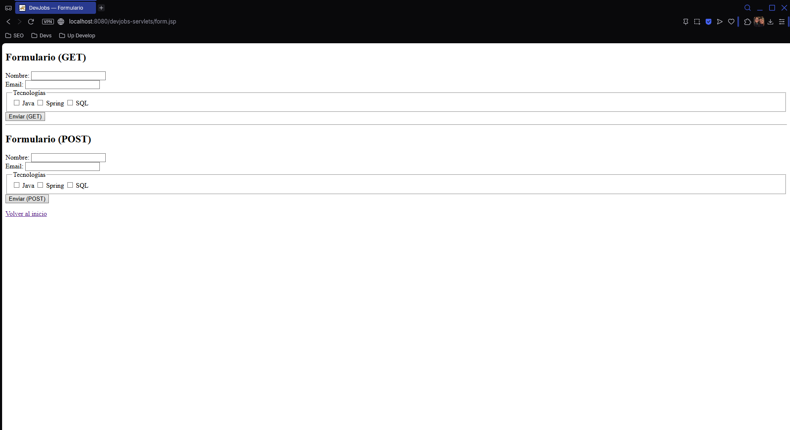
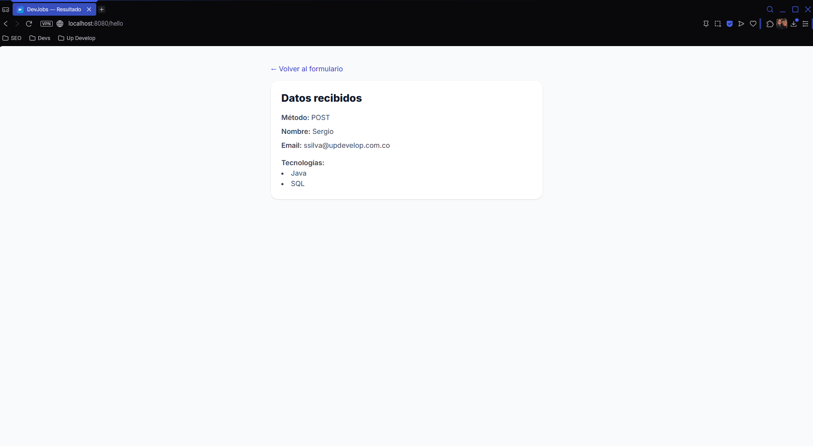

# DevJobs — GA7-220501096-AA2-EV02


Módulo web con **Jakarta Servlet 6 + JSP/JSTL** para la evidencia **GA7-220501096-AA2-EV02** (SENA).  
UI moderna 2025 con **Tailwind (CDN)** y **Inter**, **favicon** propio, **manifest**, **robots**, **páginas 404/500** personalizadas y **cabeceras de seguridad**.

## 🧩 Stack

- Java 17 · Maven · Jakarta Servlet 6 · JSP/JSTL · Tomcat 10.1
- Tailwind (Play CDN) · Inter (Google Fonts) · Favicon/Manifest
- Git/GitHub · GitHub Actions (build WAR + artifact)

## ✅ Mapeo a la evidencia SENA

- **Formularios HTML con Servlets:** `src/main/webapp/form.jsp` → envía a `/hello`.
- **GET y POST con parámetros:** `HelloServlet#doGet` / `#doPost` → forward a `result.jsp`.
- **Elementos JSP/JSTL:** `result.jsp` usa `jakarta.tags.core` (`c:forEach`, `choose/when/otherwise`).
- **Versionamiento:** repo con ramas y PRs + **CI** en GitHub Actions.

## 🗂️ Estructura principal

```
devjobs-servlets/
 └─ src/main/
    ├─ java/com/devjobs/web/
    │   ├─ HelloServlet.java
    │   └─ SecurityHeadersFilter.java
    └─ webapp/
        ├─ assets/ (favicon.svg, icon-192.png, icon-512.png)
        ├─ WEB-INF/
        │   ├─ jsp/includes/head.jspf
        │   ├─ views/error/404.jsp
        │   ├─ views/error/500.jsp
        │   └─ web.xml
        ├─ index.jsp
        ├─ form.jsp
        ├─ result.jsp
        ├─ manifest.webmanifest
        └─ robots.txt
docs/
 ├─ EJECUCION_LOCAL_TOMCAT.md
 ├─ ENLACE_REPOSITORIO.txt
 └─ capturas/ (index.png, form.png, result.png, …)
```

## ▶️ Ejecución local

Guía completa en: **[`docs/EJECUCION_LOCAL_TOMCAT.md`](docs/EJECUCION_LOCAL_TOMCAT.md)**

Rutas:

- `/<contexto>/` → `index.jsp`
- `/<contexto>/form.jsp` → formularios
- Envío a `/<contexto>/hello` (Servlet) → `result.jsp`

> Si deseas que cargue sin la página de Tomcat, despliega el WAR como **`ROOT.war`**.

## 🛡️ Extras de calidad

- **Páginas 404/500** con Tailwind (en `WEB-INF/views/error`).
- **Security headers** vía `SecurityHeadersFilter` (CSP, X-Frame-Options, etc.).
- **PWA básico**: `manifest.webmanifest`, `icons` y `theme-color`.
- **robots.txt** abierto para entornos públicos.

## 📸 Evidencias (capturas)

- Inicio: 
- Formulario: 
- Resultado: 

## 🧪 CI (GitHub Actions)

- Workflow: `.github/workflows/maven.yml`
- Artefacto: `devjobs-servlets/target/devjobs-servlets.war`

## 📦 Entrega SENA

1. Verifica las capturas en `docs/capturas/` (index, form, result).
2. Incluye `docs/ENLACE_REPOSITORIO.txt`.
3. Comprime el proyecto como **`NOMBREAPELLIDO_AA2_EV02.zip`** (según guía).
4. Sube el `.zip` al LMS.

## 📄 Licencia

Este proyecto se distribuye bajo licencia **MIT**.
